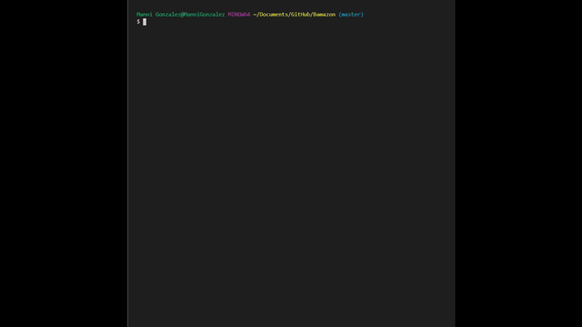
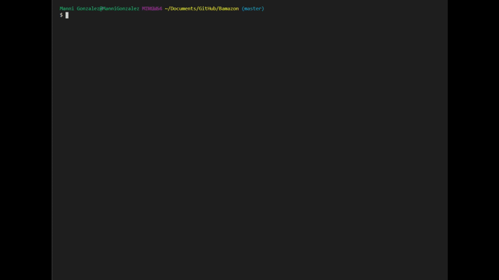

# Bamazon

## An Amazon-like storefront (CLI) connected to a MySQL Database.

**STEPS TO USE THIS YOURSELF**

1. Clone Repo.
2. Open mySQL workbench and run the schema script.
3. Open cloned repo folder in your text editor.
4. Add your mySQL password to each of the 3 .js files.
5. Open the terminal, type (npm install) without the brackets and press Enter.

### Once the npm install is complete you can choose one of the 3 node commands;

- node bamazonCustomer
- node bamazonManager
- node bamazonSupervisor  
  _\* See examples below..._

> ## Customer View
>
> **Customer can do the following;**
>
> - **View the products list.**
> - **Purchase items from the products list.**
>
> **The SQL Database stock quantity and product sales will update after each purchase.**
>
> **To access type into terminal:** node bamazonCustomer  
> **[Press Enter]**  
> **[Follow the on screen instructions]**  
> 

> ## Manager View
>
> **Manager can do the following;**
>
> - **view the products list.**
> - **view the low inventory list.**
> - **Add to stock quantities.**
> - **Add new products.**
>
> **The SQL Database will update any changes made by the Manager.**
>
> **To access type into terminal:** node bamazonManager  
> **[Press Enter]**  
> **[Follow the on screen instructions]**  
> 

> ## Supervisor View
>
> **Supervisor can do the following;**
>
> - **view Bamazon over heads, sales and profits.**
> - **Add new departments to the database table.**
>
> **The SQL Database will update any changes made by the Supervisor.**
>
> **To access type into terminal:** node bamazonSupervisor  
> **[Press Enter]**  
> **[Follow the on screen instructions]**  
> 

## Built With

- Text editor - Visual Studio Code
- Script language - JavaScript
- Runtime environment - Node.js
- Packages - mysql, inquirer, cli-table, chalk
